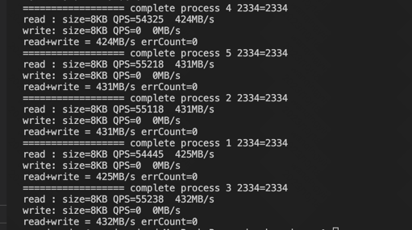
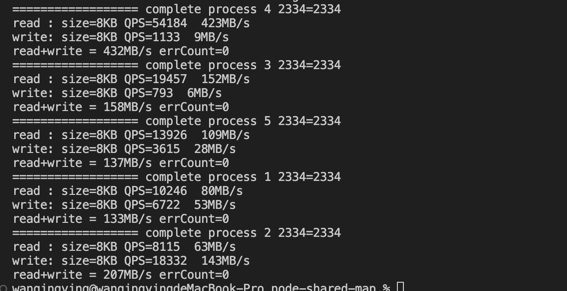
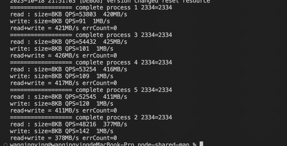

# Nodejs Shared Memory Map

a shared memory cache for nodejs, support grow/shrink, read/write lock
1. with this, every process QPS 4W+  and pipe 400MB/s data
2. i try use ipc(process.send message) to share cache ,but QPS 4k and pipe 50MB/s
3. i try use mmap or other lib, but no read/write lock so is hard to sync even crash or stuck
4. comfort for nodejs server with fork() process, local cache

## Installation

    xxx todo 

## Usage

```javascript
const addon = require('../build/Release/hello.node');
const cluster = require('node:cluster');


class ShmObject {
    cache = null;
    constructor() {
        if (cluster.isMaster || cluster.isPrimary) {
            // careful only master set true to reset memory 
            this.cache = new addon.NodeShareCache("Highscorev3", 1024 * 100, true);
        } else {
            // child process set false 
            this.cache = new addon.NodeShareCache("Highscorev3", 1024 * 100, false);
        }
        // cache expire time
        this.cache.setMaxAge(40000);
        // enable lock
        this.cache.setLock(true);

    }
    get(key) {
        return this.cache.get(key);
    }
    set(key, value) {
        return this.cache.set(key, value);
    }
}

module.exports = ShmObject;


```

## API
1. get/set with key , base data operation
2. setMaxAge , set max age for data expire,default 2000ms
3. setMaxSize , set max memory allocation size, default 800MB
4. setLock(bool), enable/disable lock
> can be disable when read only to improve performance  
> !!!!can nooooot disable when write, cause crash or stuck


## memory allocation

### grow
1.  <4MB auto grow x2 
2.  4MB-400MB auto grow 400KB
3.  400MB-4GB auto grow 4MB
4.  and custome grow

### shrink
when clean up, and free memory more than 40MB
shrink to fit the size of data

## read/write lock
1. read with shared lock    
2. write with exclusive lock
3. no timeout lock support (toto later add)
4. memory grow/shrink with exclusive lock

## benchmark
1. 5 child process , read only
   
2. 5 child process , read+write
   
3. 5 child process , read first
   