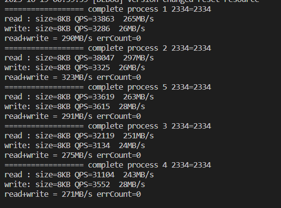

# Nodejs Shared Memory Cache


## Usage

```typescript
import { ShmCache } from 'node-share-memory-cache';

const cache = new ShmCache({
   name: 'CacheNameV1',
   size: 1024 * 1024 * 10,
   maxSize: 1024 * 1024 * 100,
});

// set cache with ttl
cache.set('key','value', 1000 * 60 * 5);
// get cache
const value = cache.get('key');
// delete key
cache.del('key');


```

## API
1. get/set with key , base data operation
2. setMaxAge , set max age for data expire,default 2000ms
3. setMaxSize , set max memory allocation size, default 800MB

## memory allocation

### auto grow
1.  [0,4MB] auto grow x2 
2.  [4MB-400MB] auto grow 400KB
3.  [400MB,inf] auto grow 4MB
4.  and custome grow

### shrink
when clean up, and free memory more than 40MB
shrink to fit the size of data

## read/write lock
1. read with shared lock    
2. write with exclusive lock
3. no timeout lock support (toto later add)
4. memory grow/shrink with exclusive lock

## benchmark
5 child process , read only, macbook pro 

   

5 child process , read+write, macbook pro

   

5 child process , read first, macbook pro

   
   
5 child process , write first, win64 i5-12490 

   