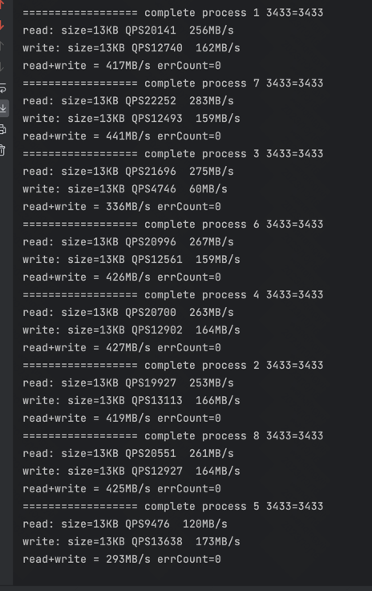

# Nodejs Shared Memory Map

benchmark results:

test with 8 child process use read/write lock
[](https://travis-ci.org/allenluce/mmap-object)

really-fast shm-based sharing of Javascript map among multiple
processes.

use boost managed_shared_memory+map to share data between processes.

use boost interprocess named_sharable_mutex to lock read/write.


## usage

## 


## Installation

    xxx todo 

## Usage

```javascript
const map = require('node-share-map')

map.open(true);
const shared_object = new Shared.Create('filename')
map.set('key',JSON.stringify({a:1,b:2}));
console.log(map.get('key'));

// todo del xxx

```

## memory allocation
// <4MB auto grow x2
// 4MB-400MB auto grow 400KB
// 400MB-4GB auto grow 4MB
// and custome grow

## read/write lock
// todo